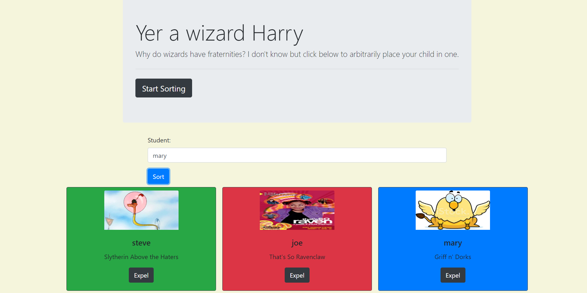

# Sorting Hat

This project is an expploration of event listeners/dom traversing. Use the sorting form to place your students into wizard schools.

## Screenshots


## How to run this project
* Use npm to install http-server in your terminal:
```sh
npm install -g http-server
```
* Run the server
```sh
hs -p 9999
```
* Open chrome and navigate to:
```
localhost:9999
```
* click start sorting
```
* enter a name and click sort